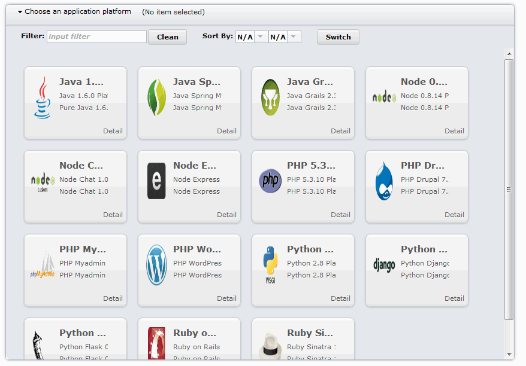
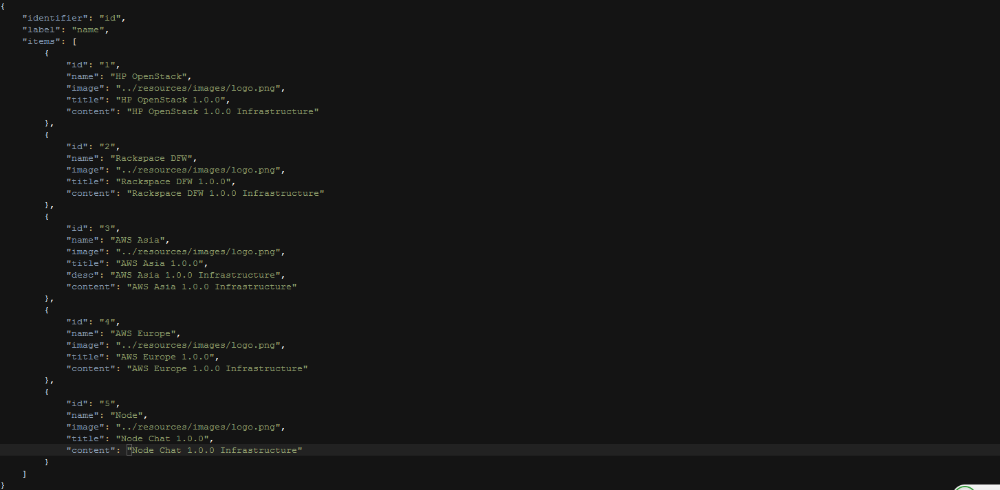

DataView
=============

Besides supporting a rich set of popular features, DataView is an square looks grid with animated effect.

DataView is consisted of:

* DataViewList component and DataViewListItem component.
* Customizable DataViewListItem template makes you to have your own special DataView Item. 
* Animation can be turn on/off at your preference.

DataView is available under [Dojo Toolkit](http://dojotoolkit.org/) [CLA](http://dojofoundation.org/about/cla) with the same [BSD/AFLv2 license] (http://dojotoolkit.org/license)

Please try the "/dataview/tests/test_DataView.html" to play this widget.
For more information, please see: https://github.com/xgzx123/dojoExtension/wiki/tutorial

<h3>Code Location:</h3>

 
 
<h3>Play with DataView Widget 1:</h3>

<h3>Play with DataView Widget 2:</h3>

 
<h3>PS: Sample Data</h3>
