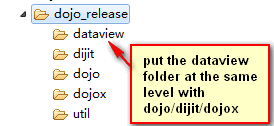

DataView
=============

Besides supporting a rich set of popular features, DataView is an square looks grid with animated effect.

DataView is consisted of:

* DataViewList component and DataViewListItem component.
* Customizable DataViewListItem template makes you to have your own special DataView Item. 
* Animation can be turn on/off at your preference.

DataView is available under [Dojo Toolkit](http://dojotoolkit.org/) [CLA](http://dojofoundation.org/about/cla) with the same [BSD/AFLv2 license] (http://dojotoolkit.org/license)

